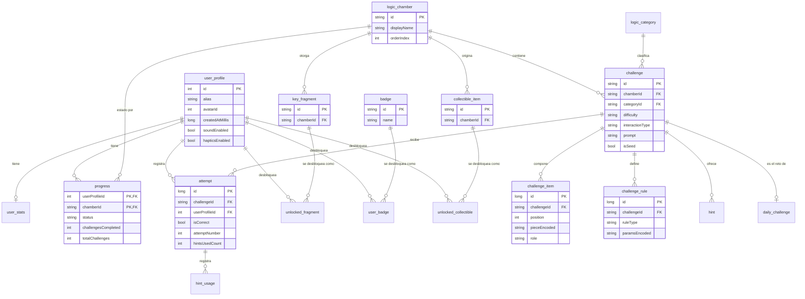

# LogicaMate — Base de Datos

Motor: **Room 2.6.1 sobre SQLite** embebido (sin servidor, 100% local). Esquema completo en [`database/schema.sql`](../database/schema.sql) (verificado ejecutándose contra SQLite real, ver `BUILD_REPORT.md`). Datos de ejemplo en [`database/sample_data.sql`](../database/sample_data.sql).

## Diagrama entidad-relación

## Notas de diseño

- **`challenge_item` separado de `challenge`** (en vez de un único blob JSON): permite renderizar cada pieza de forma individual e independiente en las pantallas de arrastrar/tocar-y-colocar, y cada fila lleva un `role` (`DISPLAY`, `OPTION`, `SOLUTION`) para distinguir enunciado, banco de piezas y solución.
- **`challenge_rule` separado**: guarda el tipo de regla (p.ej. `SEQUENCE_ARITHMETIC`, `MATRIX_TRANSFORM`, `CLASSIFICATION_RULE`) y sus parámetros serializados (`k1=v1;k2=v2`), permitiendo reconstruir exactamente qué motor y qué configuración validó ese desafío.
- **`progress` con clave primaria compuesta** `(userProfileId, chamberId)`: un perfil, un estado por cámara.
- **`attempt` conserva historial completo** (no solo el último intento): `attemptNumber` permite calcular bonos de "primer intento" y detectar resoluciones "perfectas" (sin pistas, primer intento) para el criterio de cámara "dominada".

## Simplificación documentada (regla anti-reducción-silenciosa)

`GraphErrorType` / los tipos de regla (`ruleType`) **no se modelan como tabla de lookup separada** (a diferencia de, por ejemplo, `logic_category`), sino como texto libre en `challenge_rule.ruleType`, interpretado en tiempo de ejecución por el motor correspondiente (`domain/engine/*.kt`). Se decidió así porque:

1. El conjunto de tipos de regla es fijo, pequeño (≤10 valores) y vive en el código fuente de los motores, no en datos mutables por el usuario.
2. Una tabla de lookup no protegería ninguna integridad referencial real — no hay filas que un usuario pudiera crear o corromper.
3. Está cubierto exhaustivamente por `SeedContentConsistencyTest`, que decodifica cada `ruleType`/`paramsEncoded` contra el motor real y verifica la solución almacenada.

Esta es exactamente la misma simplificación (y el mismo razonamiento) que se aplicó en el proyecto hermano GráficosDivertidos, mantenida aquí por consistencia arquitectónica dentro del mismo portafolio de apps educativas.
